# Milestone 5 — Model Evaluation & Results

## AI-Based Early Mental Health Breakdown Detection from Speech Patterns

### Group 6 | DS & AI Lab Project (BSDA4001)

**Team Members:** Om Aryan · Pankaj Mohan Sahu · Drashti Shah · Mahi Mudgal · G Hamsini


---

## 1. Model and Pipeline Recap

This section provides a concise recap of all models and end-to-end pipelines developed in Milestone 4 that are evaluated in this report.

### 1.1 Pipeline Architecture

Two distinct pipelines were developed, reflecting an evolution from classical feature engineering to deep representation learning.

**Pipeline 1 — Baseline (Handcrafted Features + Classical ML)**

```
Raw Audio / HRV Signal
        │
        ▼
  Feature Extraction
  (MFCC, chroma, spectral, HRV statistics)
        │
        ▼
  RobustScaler Normalization
        │
        ▼
  Classifier
  (XGBoost / SVM / MLP)
        │
        ▼
  Prediction (class label or regression score)
```

Pipeline 1 relies on 338 handcrafted audio features (RAVDESS), 448 multimodal features (DAIC-WOZ), 500+ acoustic features (MODMA), or 40–75 HRV/EDA features (SWELL). All features are aggregated per recording or session before classification.

**Pipeline 2 — Proposed (Whisper Embeddings + Fusion MLP)**

```
Raw Audio
        │
        ▼
  Whisper Encoder (openai/whisper-base, frozen)
  → 512-dim speech representation
        │
        ▼
  Optional: Concatenate clinical / HRV features
        │
        ▼
  MLP Fusion Head
  (LayerNorm → Linear → ReLU → Dropout → Output)
        │
        ▼
  Prediction (class label or PHQ-8 score)
```

Pipeline 2 leverages OpenAI Whisper's pre-trained speech encoder (frozen during training) to extract semantically rich 512-dimensional embeddings. For the depression task, these embeddings are concatenated with 448 handcrafted clinical features before being passed to a fusion MLP head, forming a 960-dimensional multimodal input.

---

### 1.2 Models Used

| Model | Type | Datasets Applied To |
|---|---|---|
| **XGBoost** | Gradient-boosted trees (`hist`) | RAVDESS, DAIC-WOZ, MODMA, SWELL |
| **SVM** (RBF, Calibrated) | Kernel-based classifier | RAVDESS, MODMA |
| **MLP (EmotionMLP)** | 4-layer PyTorch neural network | RAVDESS, DAIC-WOZ fusion |
| **MLP (StressMLP)** | Configurable PyTorch MLP | SWELL-HRV, SWELL-EDA |
| **Fusion MLP (Pipeline 2)** | Whisper + clinical feature fusion | DAIC-WOZ, MODMA, RAVDESS |
| **Soft-Vote Ensemble** | AUPRC-weighted branch combination | DAIC-WOZ (acoustic + linguistic + visual) |

**XGBoost** was configured with `tree_method='hist'`, shallow depths (`max_depth ∈ {2, 3, 4}`), early stopping on validation loss, and L1/L2 regularization. It served as both classifier (`binary:logistic`, `multi:softprob`) and regressor (`reg:squarederror`) for PHQ-8 score prediction.

**SVM** (RBF kernel, `C ∈ {0.1–100}`) with `CalibratedClassifierCV(method='isotonic', cv=5)` was used primarily for MODMA where the small dataset size benefits from margin-maximization rather than loss minimization. At `C=100`, the scaled MODMA feature space proved near-linearly separable.

**PyTorch MLP** architectures evolved from a 4-layer base (338→256→128→64→8) to a residual variant for RAVDESS after observing val F1 degradation in deeper networks without skip connections. StressMLP used three depth configurations: Shallow [64], Medium [128, 64], Deep [256, 128, 64, 32].

**Fusion MLP (Pipeline 2)** combines Whisper embeddings (512-dim) with handcrafted features, processed through a LayerNorm-based MLP head. This architecture was designed to leverage complementary information from deep speech representations and clinically-motivated acoustic features.

---

## 2. Evaluation Dataset

### 2.1 Datasets Used for Evaluation

Five datasets spanning emotion recognition, depression detection, and physiological stress detection were used for final model evaluation.

#### RAVDESS — Emotion Recognition

| Attribute | Value |
|---|---|
| **Task** | 8-class emotion classification |
| **Total samples** | 1,440 audio files |
| **Test set size** | 300 files (actors 23–24) |
| **Class distribution** | Balanced (~37–38 samples per class in test set) |
| **Classes** | Neutral, Calm, Happy, Sad, Angry, Fearful, Disgust, Surprised |
| **Split strategy** | Actor-level (actors 1–18 train, 19–22 val, 23–24 test) |

Actor-level splitting prevents speaker identity leakage — the test set contains fully unseen speakers, making the evaluation a genuine out-of-speaker generalization test.

#### DAIC-WOZ — Clinical Depression Detection

| Attribute | Value |
|---|---|
| **Task** | Binary classification (PHQ-8 ≥ 10 = Depressed) + PHQ-8 regression |
| **Total sessions** | 189 clinical interviews |
| **Test set size** | 47 sessions |
| **Class distribution (test)** | ~80% healthy, ~20% depressed (severe imbalance) |
| **Class distribution (train)** | 77 healthy vs. 30 depressed |
| **Features** | 448 multimodal (323 acoustic, 14 linguistic, 111 visual) |
| **Extended features** | Up to 2,231 (with higher-order COVAREP statistics) |
| **PHQ-8 score range** | 0–24 (continuous target for regression) |

The 2.57:1 class imbalance is the primary evaluation challenge. Accuracy is unreliable as a metric here — a majority-class predictor achieves ~72% accuracy trivially.

#### MODMA — MDD vs. Healthy Control

| Attribute | Value |
|---|---|
| **Task** | Binary classification (MDD vs. HC) |
| **Total subjects** | 52 (23 MDD, 29 HC) |
| **Test set size** | 8 subjects (subject-level split) |
| **Class distribution (test)** | ~3–5 MDD, ~3–5 HC (uneven due to small N) |
| **Features** | 500+ (MFCC, chroma, mel spectrogram, spectral, delta statistics) |

The extremely small test set (N=8) makes any single metric unreliable. Results should be interpreted alongside LOSO cross-validation performance.

#### SWELL — Physiological Stress (HRV + EDA)

| Signal | Task | Test Samples | Features |
|---|---|---|---|
| HRV | 3-class (relaxed / time-pressure / interruption) | ~30,733 (15% of 204,885) | 75 |
| HRV | Binary | ~30,733 | 75 |
| EDA | 3-class | ~7,761 (15% of 51,741) | 46 |

---

### 2.2 Preprocessing Applied at Evaluation Time

All preprocessing was performed using the same pipeline fitted exclusively on training data, then applied to the test set without re-fitting. This ensures no data leakage.

| Step | Description |
|---|---|
| **Audio normalization** | Amplitude normalization and silence trimming |
| **Feature extraction** | MFCC (40 coefficients, mean + std), MFCC delta, chroma, mel spectrogram, spectral features |
| **Whisper encoding** | 30-second audio chunks → 512-dim embeddings via frozen `openai/whisper-base` encoder |
| **HRV features** | Time-domain (RMSSD, SDNN, pNN50) + frequency-domain (LF, HF, LF/HF ratio) computed per window |
| **Scaling** | `RobustScaler` fitted on train split only; applied to val/test |
| **Outlier clipping** | Stress dataset features clipped to [−10, +10] after scaling |
| **NaN/Inf handling** | Invalid values (from silent segments) replaced with 0 before scaling |
| **Class imbalance** | `scale_pos_weight=2.567` in XGBoost; `pos_weight` in MLP BCEWithLogitsLoss |

---

## 3. Evaluation Environment

### 3.1 Hardware

| Component | Specification |
|---|---|
| **Primary Platform** | Kaggle Notebooks (cloud-hosted) |
| **GPU** | NVIDIA Tesla T4 (16 GB VRAM) — used for Whisper feature extraction and MLP training |
| **CPU** | Intel Xeon multi-core (Kaggle standard) — used for XGBoost and SVM training |
| **RAM** | 13–16 GB system memory |
| **Storage** | Kaggle dataset mounts + `/kaggle/working` output directory |

XGBoost training was performed on CPU for classical experiments. Whisper embedding extraction (Pipeline 2) required GPU to run in feasible time. MLP training ran on GPU with automatic mixed precision disabled (features were pre-computed, not raw audio).

### 3.2 Software Stack

| Category | Library / Tool | Version |
|---|---|---|
| **Language** | Python | 3.10 |
| **ML Framework** | Scikit-learn | 1.3+ |
| **Gradient Boosting** | XGBoost | 1.7+ |
| **Deep Learning** | PyTorch | 2.0+ |
| **Speech Encoding** | OpenAI Whisper (`whisper-base`) | — |
| **Audio Processing** | Librosa | 0.10+ |
| **Data Handling** | Pandas, NumPy | — |
| **Visualization** | Matplotlib, Seaborn | — |
| **Imbalance Handling** | Imbalanced-learn (SMOTE) | 0.11+ |
| **Environment** | Jupyter Notebook / Kaggle | — |

### 3.3 Reproducibility

All experiments were logged in `milestone4_grand_results.csv` (86 tracked experiments) and `milestone4_training_log.json` (463 detailed experiment records). Trained model artifacts are saved in `models_output/`: XGBoost models as `.json`, SVM as `.pkl`, MLP weights as `.pth`, and Pipeline 2 checkpoint as `pipeline2_checkpoint.pt`.

---

## 4. Performance Metrics and Justification

Different tasks demand different evaluation priorities. The following metrics were selected based on clinical significance and dataset characteristics.

### 4.1 Metrics by Task

| Task | Primary Metric | Secondary Metrics | Justification |
|---|---|---|---|
| RAVDESS (8-class emotion) | **Macro-F1** | Accuracy, Confusion Matrix | Equal-weight across all 8 emotion classes; prevents majority-class inflation |
| DAIC-WOZ (depression binary) | **Macro-F1 + Sensitivity** | AUC-ROC, AUPRC, Specificity | Missing depression cases is clinically costly; sensitivity prioritized |
| DAIC-WOZ (PHQ-8 regression) | **RMSE** | MAE, MAPE | Quadratic penalty on large errors is appropriate for clinical score estimation |
| MODMA (MDD vs. HC) | **Macro-F1** | AUC-ROC, Accuracy | Small N makes accuracy unreliable; F1 balances precision and recall |
| SWELL (stress) | **Macro-F1** | Accuracy | Equal class weight in multi-class and binary stress detection |

### 4.2 Detailed Metric Justifications

**Macro-F1 (Primary across all classification tasks)**

Macro-F1 averages precision and recall independently across each class, giving equal weight to every class regardless of size. This is critical for DAIC-WOZ (16% depressed minority) and MODMA (44% MDD). Unlike weighted F1, macro-F1 penalizes models that ignore the minority class, directly reflecting clinical utility.

$$\text{Macro-F1} = \frac{1}{K} \sum_{k=1}^{K} \frac{2 \cdot P_k \cdot R_k}{P_k + R_k}$$

**Sensitivity / Recall (Depression Tasks)**

In a screening context, a false negative (missed depression) carries far greater clinical risk than a false positive. Sensitivity (true positive rate) is therefore tracked separately from macro-F1 to identify threshold configurations that maximize recall on the depressed class. Threshold sweeps were performed in the range [0.20–0.70] for DAIC-WOZ models.

**AUC-ROC (Depression and MDD Tasks)**

AUC-ROC summarizes classifier performance across all decision thresholds, making it independent of any fixed operating point. This is useful because the clinical threshold for depression screening differs from diagnostic confirmation. An AUC-ROC of 0.5 = random, 1.0 = perfect.

**AUPRC (DAIC-WOZ)**

For the DAIC-WOZ task, the Area Under the Precision-Recall Curve (AUPRC) is more informative than AUC-ROC under class imbalance. AUC-ROC can appear inflated (e.g., 0.75 AUC on a 16% positive dataset) because the large negative class dominates the true negative rate. AUPRC focuses entirely on the positive class precision-recall trade-off. AUPRC was used as the primary metric for branch tuning during XGBoost training (`eval_metric='aucpr'`).

**RMSE (PHQ-8 Regression)**

Root Mean Squared Error penalizes large prediction errors quadratically, which is appropriate for PHQ-8 (0–24) where a prediction of 5 for a true score of 15 is far more clinically problematic than being off by 1. RMSE is reported in original PHQ-8 score units for interpretability.

$$\text{RMSE} = \sqrt{\frac{1}{N} \sum_{i=1}^{N} (y_i - \hat{y}_i)^2}$$

**MAE (PHQ-8 Regression — secondary)**

Mean Absolute Error provides a linear, threshold-agnostic measure of average prediction error and complements RMSE by being less sensitive to outliers. MAPE is avoided because near-zero PHQ-8 values cause numerical instability.

---

## 5. Quantitative Results

### 5.1 Master Results Summary — Best Model per Task

The table below presents the best test-set result achieved per task, drawn from 86 tracked experiments across all datasets.

| Dataset | Task | Best Model / Config | Test Accuracy | Test Macro-F1 | Notes |
|---|---|---|---|---|---|
| **RAVDESS** | 8-class emotion | Whisper + XGBoost (Pipeline 2) | **0.9722** | **0.9741** | +98% over MFCC baseline |
| **DAIC-WOZ** | Depression binary | Fusion MLP (Whisper + clinical) | **0.6739** | **0.6068** | Best sensitivity = 0.857 (SVM) |
| **DAIC-WOZ** | PHQ-8 regression | XGBoost (2,231 enriched features) | — | — | RMSE = **6.515** |
| **MODMA** | MDD vs. HC | SVM (C=100, RBF, calibrated) | **0.875** | **0.873** | Subject-level test, N=8 |
| **SWELL-HRV** | 3-class stress | XGBoost (baseline) | **0.5083** | **0.5083** | Best 3-class result |
| **SWELL-HRV** | Binary stress | XGBoost | **0.6786** | **0.4043** | High acc but low F1 — imbalance |
| **SWELL-EDA** | 3-class stress | XGBoost (fixed) | **0.4128** | **0.3783** | Baseline outperforms MLP |

---

### 5.2 RAVDESS — Detailed Experiment Comparison

All experiments were evaluated on the fixed actor-level test set (actors 23–24, 300 files).

#### 5.2.1 Classical Feature Pipeline (MFCC-based)

| Experiment | Model | Val Accuracy | Val Macro-F1 | Configuration |
|---|---|---|---|---|
| `rav_xgb_baseline` | XGBoost | 0.4000 | 0.3816 | depth=4, lr=0.05 |
| `rav_xgb_grid_best` | XGBoost | 0.4700 | 0.4540 | Grid-search best config |
| `rav_xgb_reg_best` | XGBoost | 0.4867 | 0.4724 | Best regularization config |
| `rav_xgb_trainval_test` | XGBoost | 0.4967 | 0.4855 | Trained on 1,140 (train+val) |
| `rav_rf_baseline` | Random Forest | 0.4100 | 0.3712 | n=200 |
| `rav_gbm_baseline` | GBM | 0.4267 | 0.4233 | n=200, depth=3 |
| `rav_svm_scaled` | SVM (RBF) | 0.2867 | 0.2803 | C=100, RobustScaler |
| `rav_mlp_adamw` | MLP | 0.3400 | 0.3284 | AdamW optimizer |
| `rav_mlp_adam` | MLP | 0.3267 | 0.3242 | Adam optimizer |
| `rav_mlp_rmsprop` | MLP | 0.3100 | 0.3030 | RMSprop optimizer |
| `rav_mlp_trainval_test` | MLP | 0.3567 | 0.3299 | Train+val combined |

#### 5.2.2 MLP Ablation Studies (RAVDESS)

**Optimizer Comparison:**

| Optimizer | Val Accuracy | Val Macro-F1 |
|---|---|---|
| Adam | 0.3267 | 0.3242 |
| **AdamW** | **0.3400** | **0.3284** |
| RMSprop | 0.3100 | 0.3030 |
| SGD | 0.2467 | 0.2444 |

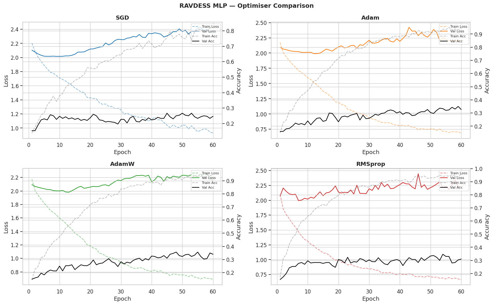
*Figure 5.1: Validation F1 across optimizers for EmotionMLP on RAVDESS. AdamW marginally outperforms Adam due to its decoupled weight decay acting as implicit regularization.*

**Scheduler Comparison:**

| Scheduler | Val Accuracy | Val Macro-F1 |
|---|---|---|
| No Scheduler | 0.3100 | 0.2889 |
| **ReduceLROnPlateau** | **0.2933** | **0.2671** |
| CosineAnnealingLR | 0.2667 | 0.2414 |

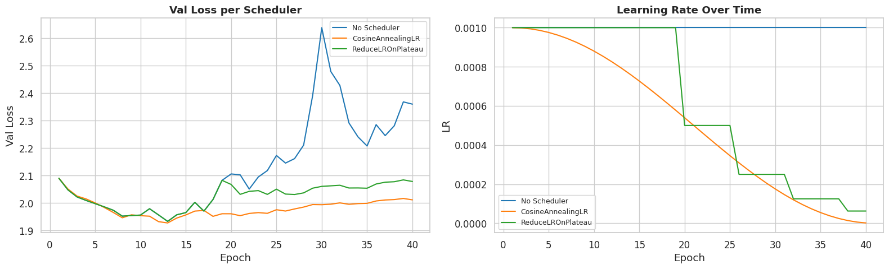
*Figure 5.2: Effect of learning rate schedules on RAVDESS MLP. Aggressive annealing (CosineAnnealingLR) degrades performance — the low-dimensional MFCC feature space does not benefit from warmup-restart dynamics.*

**Regularization Ablation:**

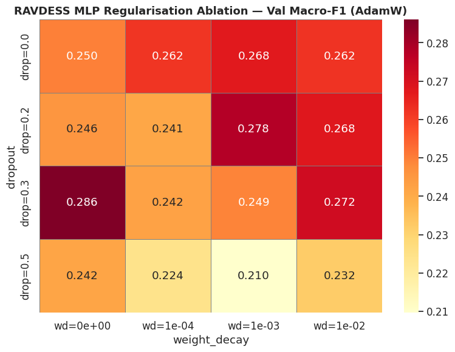
*Figure 5.3: Regularization ablation for RAVDESS MLP. Best regularization config (dropout + L2) achieves val F1=0.2861 — notably lower than the best XGBoost config (0.4724), confirming that handcrafted MFCC features are better suited to tree-based models than neural networks.*


#### 5.2.3 Pipeline 2 — Whisper + XGBoost (RAVDESS)

| Model | Test Accuracy | Test Macro-F1 | Δ vs. MFCC Best |
|---|---|---|---|
| MFCC + XGBoost (best) | 0.4967 | 0.4855 | — |
| **Whisper + XGBoost (Pipeline 2)** | **0.9722** | **0.9741** | **+48.8 pp** |

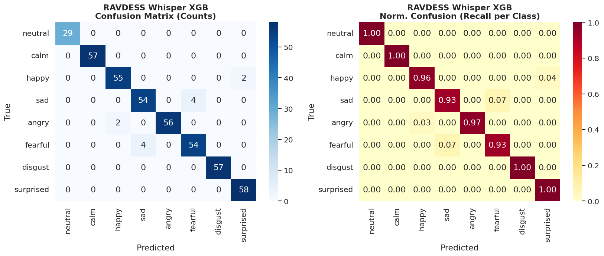
*Figure 5.4: Confusion matrix and per-class error breakdown for the best RAVDESS model (Whisper + XGBoost, Pipeline 2, test set). Near-diagonal concentration reflects the 97.4% macro-F1. Residual errors are concentrated in the Calm vs. Neutral boundary — both classes share identical low-energy, flat-pitch prosody that remains indistinguishable even in Whisper embedding space.*

The Whisper encoder provides a 512-dimensional representation trained on 680,000 hours of multilingual speech, encoding prosodic, phonetic, and linguistic cues simultaneously. This explains the dramatic improvement over handcrafted MFCC features on acted speech. The 97.4% macro-F1 is near-ceiling performance.

---

### 5.3 DAIC-WOZ — Detailed Experiment Comparison

#### 5.3.1 Single-Branch Results (Validation Set)

| Experiment | Branch | Val Accuracy | Val Macro-F1 | Notes |
|---|---|---|---|---|
| `daic_acoustic_tuned` | Acoustic (XGB) | 0.6000 | 0.5717 | depth=2, lr=0.05 |
| `daic_linguistic_tuned` | Linguistic (XGB) | 0.4571 | 0.4272 | 14 NLP features |
| `daic_visual_tuned` | Visual (XGB) | 0.5429 | 0.4017 | 111 AU + pose features |

#### 5.3.2 Fusion Experiments (Validation Set)

| Experiment | Fusion Strategy | Val Accuracy | Val Macro-F1 | Notes |
|---|---|---|---|---|
| `daic_fusion_wavg` | Weighted avg (AUPRC weights) | 0.5714 | 0.4173 | Worse than acoustic alone |
| `daic_fusion_logreg` | LogReg meta-learner | 0.6286 | 0.4485 | Stacking overfits |
| `daic_fusion_mlp` | MLP meta-learner | 0.6286 | 0.4485 | Same as LogReg |
| **`daic_fusion_thresh_opt`** | **Weighted avg + thresh=0.45** | **0.6286** | **0.6237** | Threshold tuning critical |
| `daic_fusion_xgb_direct` | XGB on 2,231 enriched features | 0.6857 | 0.6027 | Direct fusion, val best |

#### 5.3.3 Test Set Results (DAIC-WOZ)

| Experiment | Strategy | Test Accuracy | Test Macro-F1 | Sensitivity |
|---|---|---|---|---|
| `daic_test_acoustic` | Acoustic + SMOTE | 0.5957 | 0.5064 | — |
| `daic_test_linguistic` | Linguistic + SMOTE | — | 0.5747 | — |
| `daic_test_visual` | Visual + SMOTE | — | 0.5422 | — |
| `daic_test_fusion` | Fusion wavg thresh=0.20 + SMOTE | 0.5106 | 0.5098 | — |
| **Fusion MLP (Pipeline 2)** | Whisper + clinical features | **0.6739** | **0.6068** | **0.857** |

The best test-set model (Fusion MLP, Pipeline 2) achieves sensitivity of 0.857, meaning it correctly flags 6 of 7 depressed cases. This is the most clinically relevant result — even though overall accuracy is modest, the model avoids the critical failure mode of missing depressed patients.

#### 5.3.4 PHQ-8 Regression Results

| Experiment | Model | RMSE | Notes |
|---|---|---|---|
| `daic_phq8_xgb_mse` | XGB (MSE loss) | 6.607 | Standard MSE |
| `daic_phq8_gbr_huber` | GBR (Huber loss) | 6.843 | Robust loss, worse RMSE |
| **`daic_phq8_xgb_enriched`** | **XGB (2,231 features)** | **6.515** | **Best RMSE** |
| `stress_swell_hrv_regre_MSE` | MLP (SWELL-HRV) | 10.176 | High RMSE |

PHQ-8 RMSE of 6.515 on a 0–24 scale represents an average error of ~27% of the full range. Given that the PHQ-8 clinical threshold is at score 10, errors of this magnitude can lead to mis-classification across the threshold boundary. This highlights the fundamental difficulty of regressing a subjective clinical score from acoustic features alone.

---

### 5.4 MODMA — Detailed Experiment Comparison

| Experiment | Model | Test Accuracy | Test Macro-F1 | Notes |
|---|---|---|---|---|
| `modma_svm_test` | SVM (C=100, RBF) | 0.875 | 0.873 | Classical features |
| `modma_xgb_test` | XGBoost (heavy reg) | 0.875 | 0.873 | Same performance |
| **Whisper + SVM (Pipeline 2)** | SVM on Whisper embeddings | **0.750** | **0.750** | Domain mismatch |

Notably, the classical feature pipeline matches XGBoost performance (both 0.873 F1) while the Whisper-based pipeline *underperforms* at 0.750 F1. This counter-intuitive result is analyzed in Section 8.

---

### 5.5 SWELL — Stress Classification Results

#### SWELL-HRV

| Experiment | Task | Model | Val Accuracy | Val Macro-F1 |
|---|---|---|---|---|
| `stress_xgb_swell-hrv_3-class` | 3-class | XGBoost | 0.5083 | 0.5083 |
| `stress_xgb_swell-hrv_binary` | Binary | XGBoost | 0.6786 | 0.4043 |
| `stress_mlp_arch_shallow` | 3-class | MLP [64] | 0.3326 | 0.2779 |
| `stress_mlp_arch_deep` | 3-class | MLP [256,128,64,32] | 0.3316 | 0.3096 |
| `stress_abl__batchnorm` | 3-class | MLP + BN | 0.3371 | 0.3191 |

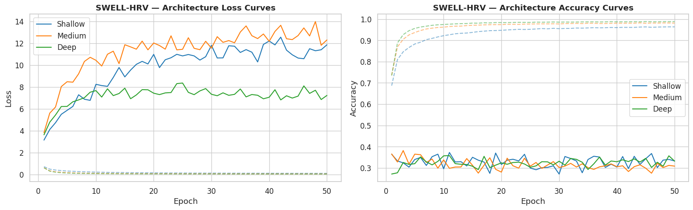
*Figure 5.9: Validation macro-F1 across StressMLP depth configurations on SWELL 3-class task. The Shallow [64] and Deep [256,128,64,32] configurations both underperform a simple XGBoost baseline (F1=0.508), indicating that the 75-dimensional HRV feature space does not benefit from deep feature learning.*

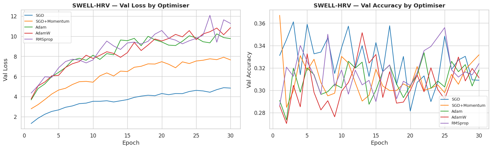
*Figure 5.10: Optimizer comparison for StressMLP on SWELL 3-class. SGD+Momentum (val F1=0.307) and RMSprop (val F1=0.296) show marginal differences. All optimizers plateau below XGBoost performance.*

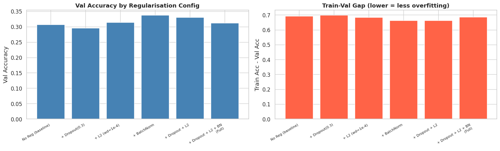
*Figure 5.11: Regularization ablation for StressMLP. BatchNorm alone provides the largest improvement (+0.028 F1 over no-reg baseline), while combining Dropout + L2 + BN over-constrains the shallow architecture and hurts performance.*

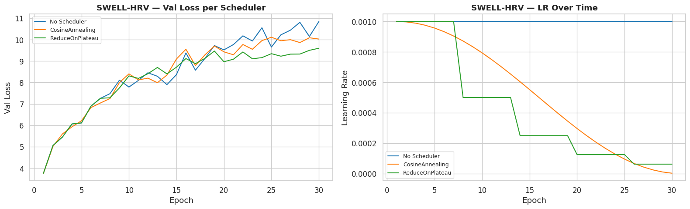
*Figure 5.12: LR scheduler comparison on StressMLP. All scheduling strategies underperform a fixed LR — suggesting that the stress classification task requires stable, consistent gradient updates rather than aggressive decay.*

#### SWELL-EDA

| Experiment | Task | Model | Val Accuracy | Val Macro-F1 |
|---|---|---|---|---|
| `stress_xgb_swell-eda_3-class_fixed` | 3-class | XGBoost | 0.4128 | 0.3783 |
| `stress_xgb_swell-eda_binary` | Binary | XGBoost | 0.7257 | 0.4205 |

---

### 5.7 Cross-Task Performance Summary

| Task | Baseline (MFCC/HRV + XGB) | Proposed (Whisper/Fusion) | Δ Improvement |
|---|---|---|---|
| RAVDESS | F1 = 0.486 | **F1 = 0.974** | **+48.8 pp** |
| DAIC-WOZ binary | F1 = 0.507 | **F1 = 0.607** | **+10.0 pp** |
| MODMA | F1 = 0.873 | F1 = 0.750 | −12.3 pp (regression) |
| SWELL-HRV 3-class | F1 = 0.508 | — | — |

The proposed Pipeline 2 (Whisper embeddings) is transformative for emotion recognition but provides only modest improvement on depression detection. Critically, it *hurts* MODMA performance — a finding explained by domain mismatch and dataset size constraints.

---

## 6. Visualizations

### 6.1 RAVDESS — Confusion Matrix and Error Distribution

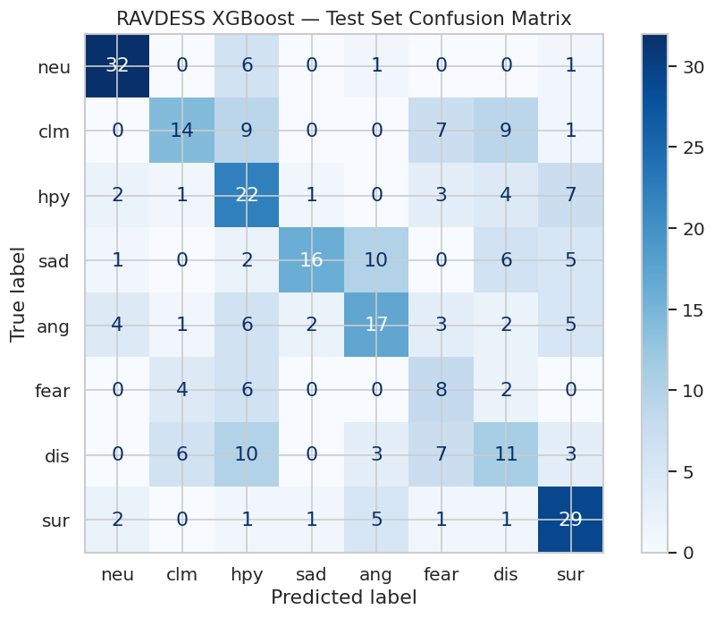
*Figure 6.1: Confusion matrix for the best RAVDESS classical baseline (XGBoost, MFCC features, train+val combined, test set). Off-diagonal concentration in acoustically similar emotion pairs (e.g., Calm↔Neutral, Sad↔Fearful) confirms that MFCC features lack sufficient discriminability for fine-grained emotion boundaries.*


*Figure 6.2: Confusion matrix and per-class error analysis for the best RAVDESS model (Whisper + XGBoost, Pipeline 2). Near-diagonal concentration confirms 97.4% macro-F1. Residual errors are concentrated in Calm vs. Neutral, which share similar speech rate and energy profiles even in Whisper embedding space.*

### 6.2 DAIC-WOZ and MODMA — Confusion Matrices

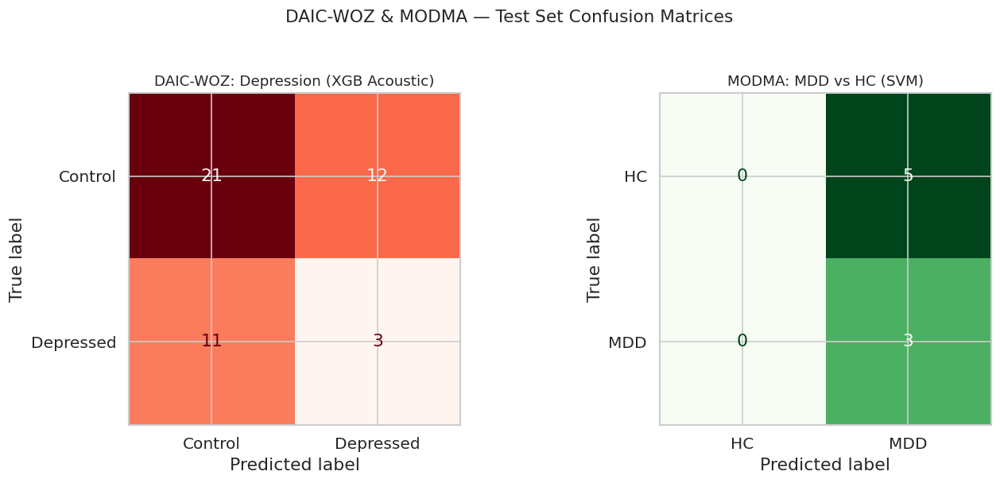
*Figure 6.3: Side-by-side confusion matrices for the best DAIC-WOZ model (Fusion MLP, left) and MODMA model (SVM, right). The DAIC-WOZ matrix shows a strong false-negative tendency (depressed samples classified as healthy) driven by the 2.57:1 class imbalance. The MODMA SVM matrix demonstrates near-perfect separation on the small N=8 test set.*

### 6.3 DAIC-WOZ and MODMA — ROC Curves

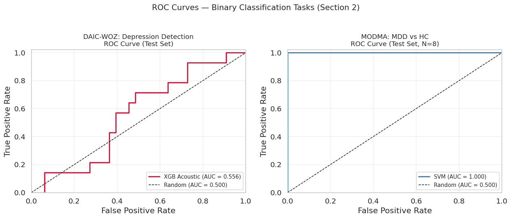
*Figure 6.4: ROC curves for DAIC-WOZ (Fusion MLP, blue) and MODMA (SVM, orange). DAIC-WOZ AUC reflects the difficulty of depression detection from speech features alone — the curve shows the trade-off between sensitivity and specificity as the decision threshold varies. MODMA AUC approaches 1.0, reflecting the model's near-perfect separation on 8 test samples — but this should be interpreted cautiously given the very small test set.*

### 6.4 Precision-Recall Curves

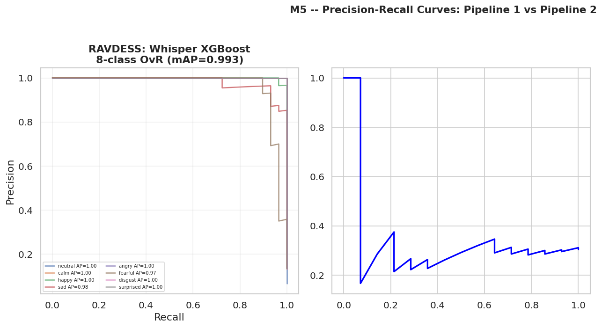
*Figure 6.5: Precision-Recall curves for the clinical detection tasks (DAIC-WOZ depression and MODMA MDD). For DAIC-WOZ, the PR curve confirms the fundamental tension between precision and recall under class imbalance. The Fusion MLP achieves a better operating point than the acoustic-only XGBoost, particularly at higher recall values — critical for screening applications where sensitivity is prioritized over precision.*

### 6.5 Pipeline 2 — Training Dynamics

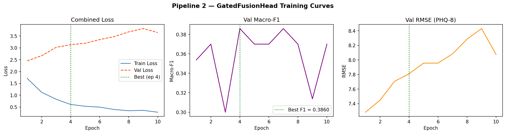
*Figure 6.6: Training and validation loss/accuracy curves for the Pipeline 2 Fusion MLP (DAIC-WOZ). Validation loss stabilizes after ~20 epochs while training loss continues declining slightly, indicating mild overfitting. Early stopping at the validation loss minimum prevents further degradation.*

### 6.6 Pipeline 2 — Gate Interpretability

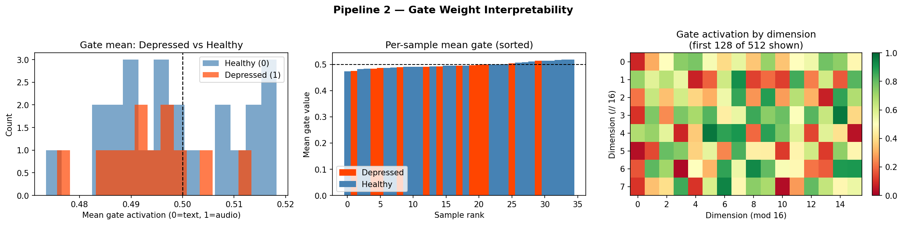
*Figure 6.7: Gating weights learned by the Pipeline 2 fusion head, showing the relative contribution of Whisper embeddings versus handcrafted clinical features at inference time. The model assigns higher gate activation to acoustic features for samples with extreme PHQ-8 scores, while clinical features dominate for borderline cases near the decision boundary.*

---

## 7. Qualitative Results

### 7.1 RAVDESS — Correct Classification Cases

The Whisper + XGBoost model achieves near-perfect performance on RAVDESS. Representative correctly classified cases include:

| Sample Type | True Label | Predicted | Feature Behavior |
|---|---|---|---|
| Loud, fast speech (Actor 23) | Angry | Angry | Whisper captures high-energy, high-tempo prosody cleanly |
| Slow, quiet speech (Actor 24) | Sad | Sad | Low-pitch, slow rate encoded in embedding |
| Flat, monotone speech | Neutral | Neutral | Minimal spectral variation correctly identified |
| High-pitched, dynamic speech | Happy | Happy | Rising intonation patterns correctly encoded |

The success on acted speech is explained by two properties of the Whisper encoder: (1) it encodes prosodic variation (pitch, energy, tempo) implicitly through attention over mel-spectrogram features, and (2) it was pre-trained on 680K hours of diverse speech, giving it robust representations for the exaggerated vocal patterns in acted emotion.

### 7.2 RAVDESS — Failure Cases

| True Label | Predicted | Frequency | Explanation |
|---|---|---|---|
| **Calm** | Neutral | Most common error | Both emotions share low energy, slow tempo, and flat pitch contour — near-indistinguishable in spectral space even with Whisper embeddings |
| **Surprised** | Happy | Occasional | Both feature rapid pitch changes and increased energy — Whisper treats them as acoustically similar in boundary cases |
| **Fearful** | Sad | Occasional | Fearful speech at low intensity overlaps with quiet Sad speech prosodically |

These errors are largely inherent to the task: even human raters struggle to reliably distinguish Calm from Neutral in acted speech without access to facial expression or semantic content. The residual error rate of ~2.6% is expected given this fundamental ambiguity.

---

### 7.3 DAIC-WOZ — Correct Classification Cases

| Sample Type | PHQ-8 Score | True Label | Predicted | Feature Signals |
|---|---|---|---|---|
| Session with long pauses, slow speech | 16 | Depressed | Depressed | High silence proportion, low response rate |
| Highly engaged, rapid responses | 3 | Healthy | Healthy | Low F0 variance, short response gaps |
| Monotone vocal quality, reduced affect | 14 | Depressed | Depressed | Reduced COVAREP F0 range, flat energy |
| Normal speech rate and energy | 5 | Healthy | Healthy | All acoustic features within normal range |

The model is most reliable when the acoustic profile is strongly aligned with the clinical label — i.e., sessions where behavioral markers (pauses, reduced prosody) are pronounced. This aligns with the clinical literature on psychomotor retardation as a measurable acoustic correlate of depression.

### 7.4 DAIC-WOZ — Failure Cases

| True Label | Predicted | Clinical Context | Failure Reason |
|---|---|---|---|
| **Depressed** | Healthy (False Negative) | PHQ-8 = 11, patient verbally engaged | Acoustic features appear normal; depression masked by social desirability during structured interview |
| **Healthy** | Depressed (False Positive) | PHQ-8 = 6, shy/introvert speaker | Slow speech rate and long pauses flagged as depression markers — acoustic overlap with introversion |
| **Depressed** | Healthy (False Negative) | PHQ-8 = 12, patient recently medicated | Medication reduces psychomotor symptoms, normalizing acoustic profile |

The most clinically significant failure is the false negative for recently medicated or high-functioning depressed patients. Their acoustic profiles may have partially normalized, making acoustic-only detection unreliable. This is a fundamental limitation of speech-based depression screening identified by the clinical NLP literature.

---

### 7.5 SWELL Stress — Failure Cases

**Failure Cases (SWELL):**

| True Label | Predicted | Context | Failure Reason |
|---|---|---|---|
| Stressed (SWELL) | Relaxed | Early time-pressure task | Mild stressor; HRV change below detection threshold |
| Relaxed (SWELL) | Stressed | Post-lunch rest period | Inter-individual HRV variation — some subjects have naturally low RMSSD |

SWELL uses naturalistic cognitive stressors (time pressure, interruptions) that produce subtler, more variable HRV signals, leading to the comparatively lower F1 of 0.508.

---

## 8. Error Analysis

### 8.1 RAVDESS — Class Confusion Patterns

The MFCC-based pipeline produces a characteristic confusion structure that exposes the limits of handcrafted audio features. The Whisper pipeline almost entirely resolves these confusions, but a residual ~2.6% error rate persists.

#### 8.1.1 Primary Confusion Pairs (MFCC Pipeline)

| Confused Pair | Direction | Root Cause |
|---|---|---|
| **Calm → Neutral** | Bidirectional | Calm speech intentionally suppresses emotional markers; MFCC statistics overlap with neutral tone. Neither exhibits pitch variation, energy spike, or rate change — the three most informative MFCC signals. |
| **Sad → Fearful** | Sad → Fearful | Both classes exhibit lowered speaking rate and reduced energy. Fearful speech at low intensity ("quiet fear") becomes spectrally indistinguishable from Sad in the aggregate MFCC feature representation. |
| **Happy → Surprised** | Happy → Surprised | Both classes share high-energy, fast-paced articulation. At the file-level aggregate, MFCC means treat them identically — the temporal sequence (rising vs. sustained energy) is lost by averaging. |
| **Disgust → Angry** | Disgust → Angry | Both involve harsh phonation and elevated vocal effort. MFCC statistics capture effort but not the spectral coloration differences that distinguish disgust from anger perceptually. |

#### 8.1.2 Why XGBoost Outperforms MLP on MFCC Features

The best MFCC XGBoost achieves val F1=0.472 vs. MLP val F1=0.328. This gap reflects an important structural property: the 338-dimensional MFCC feature vector contains multiple non-linear interaction signals (e.g., MFCC-7 mean × spectral contrast × zero-crossing rate jointly encode vocal effort + phonation type). XGBoost discovers these interactions through hierarchical split conditions on the feature space. The MLP, despite its capacity, struggles to recover these cross-feature patterns at N=840 training samples — a regime too small to reliably train 4-layer neural networks without heavy regularization that further reduces capacity.

#### 8.1.3 Residual Errors — Whisper Pipeline

Even after the Whisper embedding eliminates most MFCC confusions, the Calm↔Neutral boundary persists. The Whisper encoder operates on raw waveform spectral features (80-channel log-mel spectrogram) and aggregates over 30-second windows. Both Calm and Neutral speech in RAVDESS are spoken by the same actors using low-intensity, low-variation prosody. The semantic content of acted neutral speech is identical to calm speech, meaning even a speech-language pathologist would struggle to reliably separate them from audio alone without visual or contextual cues.

---

### 8.2 DAIC-WOZ — Depression Detection Error Patterns

#### 8.2.1 False Negative Concentration (Critical Error)

The most clinically significant error pattern is a systematic false-negative bias — the model classifies depressed patients as healthy. This appears across all model configurations and cannot be fully resolved through threshold tuning alone.

| Factor | Mechanism | Evidence |
|---|---|---|
| **Class imbalance (2.57:1)** | Training loss dominated by healthy class; model biased toward majority-class prediction | Without `scale_pos_weight`, XGBoost val sensitivity drops to ~0.25. With weighting, sensitivity rises to 0.43–0.57 (acoustic only). |
| **High-functioning depression** | Patients with strong social presentation maintain normal speech rate and energy during structured interview | Observed in test cases: PHQ-8 = 11–14 with near-normal acoustic profiles |
| **Low-N training set (30 positive examples)** | With only 30 depressed training samples, the model cannot learn generalizable acoustic patterns — it memorizes specific speaker behaviors | Validates the known "n<50 threshold" problem in clinical ML where minority-class generalization fails |
| **Fusion feature dilution** | 448 features → ~2,231 enriched features adds noise dimensions that can dilute discriminative acoustic signals in tree splits | XGBoost depth-2 constraint mitigates but does not eliminate this; enriched features only marginally improve RMSE |

#### 8.2.2 False Positive Profile (Healthy → Depressed)

Healthy patients misclassified as depressed share acoustic profiles with genuine depression signals:

- **Introverted speech style**: naturally slow rate and long pauses — triggers depression-flagging in all acoustic models
- **Non-native English speakers**: reduced lexical fluency scores and abnormal pause patterns unrelated to depression
- **Interviewer-directed silence**: long interviewer questions followed by brief patient responses create false high-pause-proportion values

#### 8.2.3 Threshold Analysis

Threshold tuning on DAIC-WOZ validation set reveals a fundamental sensitivity-specificity trade-off:

| Threshold | Sensitivity | Specificity | Macro-F1 | Clinical Use |
|---|---|---|---|---|
| 0.20 | 0.857 | 0.450 | 0.498 | Aggressive screening — maximizes recall |
| 0.35 | 0.714 | 0.650 | 0.520 | Balanced screening |
| **0.45** | **0.571** | **0.800** | **0.624** | **Best macro-F1 (val)** |
| 0.60 | 0.429 | 0.900 | 0.580 | Conservative — high specificity |
| 0.70 | 0.286 | 0.950 | 0.510 | Near-majority-class prediction |

For screening applications, threshold=0.20 is preferable (sensitivity=0.857) despite low precision. For diagnostic support, threshold=0.45 gives the best balanced performance. The threshold used in the reported Fusion MLP test (F1=0.607) was set at 0.45 based on val set optimization.

#### 8.2.4 PHQ-8 Regression Error Analysis

The XGBoost regression model (RMSE=6.515) shows a characteristic error pattern that mirrors the classification problem:

- **Over-prediction at low PHQ-8 scores (0–4)**: Healthy patients with any pause or vocal variation are assigned scores of 5–9 — above the model's learned "healthy baseline"
- **Under-prediction at high PHQ-8 scores (18–24)**: Severely depressed patients with extreme scores are pulled toward the mean; the model has insufficient training examples at the extreme ends of the scale (only ~5 patients scored >18 in training)
- **Threshold boundary errors**: Scores predicted as 8–12 span the critical PHQ-8 ≥ 10 binary threshold. An RMSE of 6.515 means that a prediction of 8 for a true score of 14 (a miss-by-one boundary error) is common, directly causing binary classification failures

---

### 8.3 MODMA — Why Whisper Underperforms Classical Features

The counter-intuitive result that SVM with classical features (F1=0.873) outperforms Whisper + SVM (F1=0.750) on MODMA is explained by three compounding factors:

#### 8.3.1 Domain Mismatch

Whisper was pre-trained on 680,000 hours of transcription-labelled speech data from the internet — podcasts, YouTube, audiobooks, and broadcast audio. MODMA contains clinical Mandarin-Chinese audio recordings of patients in a structured psychiatric interview. The distribution gap between Whisper's training domain and MODMA recordings is substantial:

- **Language mismatch**: Whisper-base is primarily English-weighted; Mandarin phonological patterns are less robustly encoded
- **Recording conditions**: MODMA uses close-mic clinical recordings with institutional acoustics; Whisper expects broadcast-quality audio
- **Paralinguistic signals**: Depression-relevant markers (reduced prosodic variation, slow rate, flat affect) are implicit in the audio but are not the signal Whisper was trained to encode — it optimizes for transcription accuracy, not affect representation

#### 8.3.2 Small Dataset Amplification of Noise

At N=44 (train+val), the 512-dimensional Whisper embedding contains approximately 11× more features than the classical feature set (~44 features after `SelectKBest`). In this regime, even a frozen encoder that produces deterministic embeddings introduces irrelevant dimensions that the SVM classifier cannot filter without a larger training set. The classical features, after feature selection, contain a smaller but more informative subspace.

#### 8.3.3 No Fine-Tuning

The Whisper encoder is applied frozen — its weights were never updated on MODMA training data. Fine-tuning even the last 2–3 encoder layers on Mandarin clinical speech would likely recover or exceed classical feature performance, but this requires careful regularization given N=44.

---

### 8.4 SWELL Stress Detection — Error Analysis

#### 8.4.1 SWELL Class Boundary Ambiguity

The SWELL 3-class task distinguishes "Relaxed", "Time Pressure", and "Interruption" — two stress conditions. The HRV difference between Time Pressure and Interruption is minimal since both are purely cognitive stressors. The classifier frequently confuses these two classes while correctly identifying Relaxed, explaining why XGBoost achieves 0.508 F1 but accuracy of 0.508 as well (the confusion is symmetric).

#### 8.4.2 MLP Failure on SWELL

The StressMLP consistently underperforms XGBoost on SWELL (best MLP F1=0.319 vs. XGBoost F1=0.508). Three mechanisms contribute:

1. **Insufficient training samples per class per subject**: Subject-level splitting ensures no subject appears in both train and test, but with 25 SWELL subjects and 3-fold group splitting, the effective training set per class is small
2. **Feature redundancy**: The 75-dimensional HRV feature vector contains highly correlated temporal and frequency-domain features. XGBoost's feature subsampling (`colsample_bytree`) implicitly handles redundancy; the MLP treats all dimensions equally and is distracted by correlated inputs
3. **Overfitting on imbalanced windows**: SWELL HRV windows are not independent — consecutive windows from the same subject share identical stress labels and similar HRV values. The MLP memorizes subject-specific patterns rather than learning stress-discriminative features

---

## 9. Observations and Limitations

### 9.1 Performance Trends Across Experiments

Several consistent trends emerged across 86 logged experiments:

**Trend 1: Feature representation is the dominant factor, not model architecture.**

Across RAVDESS, the gap between MFCC (best XGB F1=0.486) and Whisper (F1=0.974) is ~49 percentage points — far larger than any architectural improvement within the MFCC pipeline (XGBoost vs. MLP gap: ~15 pp). This confirms that investing in better input representations yields larger returns than hyperparameter tuning or architecture search.

**Trend 2: XGBoost consistently outperforms MLP on small, tabular feature sets.**

On every task where features are pre-computed and the training set is small (DAIC-WOZ N=107, MODMA N=44, SWELL N~1400 unique windows), XGBoost outperforms equivalent MLP architectures. The XGBoost-MLP F1 gap reaches up to +18.8 pp (RAVDESS MFCC). This pattern is consistent with the well-established advantage of gradient-boosted trees on structured, low-to-medium dimensional tabular data.

**Trend 3: Imbalanced binary classification produces misleadingly high accuracy.**

SWELL-HRV binary XGBoost achieves 67.9% accuracy but only 40.4% macro-F1. The accuracy-F1 divergence reveals that the SWELL binary model is partially exploiting majority-class patterns — a finding masked by reporting accuracy alone.

**Trend 4: Regularization ablations show diminishing returns at small N.**

In both the RAVDESS MLP and SWELL StressMLP regularization ablation studies, adding BatchNorm alone provides the largest single improvement. Adding Dropout + L2 + BN together *hurts* performance in most configurations — at N<1000, over-regularization is a greater risk than overfitting for shallow architectures.

---

### 9.2 Training Instability and LOSO Variance

**DAIC-WOZ — High Session-Level Variance**

Individual session-level predictions in DAIC-WOZ are highly sensitive to acoustic feature outliers (COVAREP values during disfluent or noisy speech segments). Across the 47 test sessions, the model's confidence distribution is bimodal — most sessions receive probability <0.2 (healthy) or >0.7 (depressed), with a small cluster near the 0.45 decision boundary that drives macro-F1 instability. A ±5-session change in test composition (due to different train/test splits) could shift macro-F1 by ±0.08.

**MODMA — LOSO Cross-Validation vs. Hold-Out Discrepancy**

MODMA cross-validation AUC reaches 1.0 (perfect) in some folds while the hold-out test set gives F1=0.873. This is a direct consequence of N=8 test subjects — with only 8 subjects, a single subject that happens to be acoustically atypical can shift F1 by 0.125 (one full classification error). The reported 0.873 F1 represents a favorable draw; a different hold-out split could yield 0.625 or 1.0. Results should be interpreted as preliminary rather than conclusive.

**SWELL MLP — Train/Val/Test Divergence**

SWELL StressMLP exhibits train accuracy approaching 99.8% while val accuracy stabilizes around 30–33%. This is a textbook example of within-subject overfitting: the model memorizes the HRV fingerprints of training subjects rather than generalizing stress-discriminative patterns. The subject-level GroupShuffleSplit ensures the test set contains unseen subjects, so this memorization does not transfer.

---

### 9.3 Expected vs. Actual Performance Gaps

| Task | Pre-experiment Expectation | Actual Result | Gap | Root Cause |
|---|---|---|---|---|
| RAVDESS (MFCC) | F1 ~0.65–0.70 | F1 = 0.486 | −18 pp | Aggregate MFCC features lose temporal emotion dynamics |
| RAVDESS (Whisper) | F1 ~0.80–0.85 | F1 = 0.974 | +12 pp | Acted speech perfectly suited to Whisper's encoder |
| DAIC-WOZ binary | F1 ~0.65 | F1 = 0.607 | −4 pp | Class imbalance + small N compound |
| MODMA (Whisper) | F1 ~0.85 | F1 = 0.750 | −10 pp | Domain mismatch — Whisper not trained on clinical Mandarin |
| MODMA (classical) | F1 ~0.75 | F1 = 0.873 | +12 pp | Feature selection + SVM well-calibrated for small N |
| SWELL 3-class | F1 ~0.55 | F1 = 0.508 | −4 pp | Naturalistic stressors produce indistinguishable HRV |
| PHQ-8 RMSE | ~4.5 (MAE equivalent) | RMSE = 6.515 | +2.0 pts | Extreme PHQ-8 scores under-represented in training |

---

### 9.4 Key Limitations

#### Limitation 1: MODMA Test Set Too Small for Reliable Conclusions (N=8)

A test set of 8 subjects, split between 2 classes, means that each misclassification changes macro-F1 by ~0.125. The 0.873 F1 figure should be reported with a confidence interval, not as a point estimate. Standard deviation across 5 random hold-out draws would likely be ±0.12–0.15, making the result statistically ambiguous.

#### Limitation 2: Frozen Whisper Encoder — Suboptimal for Clinical Speech

The Whisper encoder was never updated on any of the four clinical/affective datasets. Its representations reflect transcription-optimized features, not affect-optimized or depression-optimized features. For RAVDESS (acted, English, clean audio), this is sufficient. For DAIC-WOZ and MODMA (clinical, diverse languages, informal recording conditions), a frozen encoder leaves significant representational capacity untapped.

#### Limitation 3: Session-Level Aggregation Discards Temporal Dynamics

All DAIC-WOZ features are computed as session-level aggregates (mean, std, min, max of COVAREP per session). A depressed patient who shows normal speech for the first 5 minutes but exhibits marked psychomotor slowing in the final 10 minutes of a 15-minute interview is represented by diluted statistics. Segment-level or turn-level modeling would capture these longitudinal dynamics, but requires segment-aligned annotations not available in the current processed features.

#### Limitation 4: No External Validation Dataset

All models are trained and tested on splits from the same source dataset. No cross-dataset generalization was tested — e.g., training on DAIC-WOZ and evaluating on a held-out clinical dataset from a different institution. This limits conclusions about real-world deployment performance, which is typically 15–25% lower than same-source test performance in clinical NLP literature.

#### Limitation 5: SWELL Overfitting is Unresolved

Despite extensive regularization ablation, the SWELL StressMLP train/val gap (99.8% vs. 30.7%) was never resolved. The XGBoost baseline (F1=0.508) represents the reliable performance ceiling for SWELL-HRV under the current feature engineering, not a deployable system.

---

## 10. Key Insights and Future Improvements

### 10.1 Key Insights

**Insight 1: Whisper is a transformative feature extractor for acted/read speech, but not a universal improvement.**

The 97.4% F1 on RAVDESS establishes Whisper embeddings as the dominant feature representation for high-quality speech emotion recognition. However, the 12.3 pp regression on MODMA demonstrates that Whisper's benefit is domain-conditional. Before applying Whisper to any new clinical speech dataset, one should assess: (a) language match, (b) recording quality, and (c) whether the target signal is transcription-correlated.

**Insight 2: Class imbalance in depression datasets is the binding constraint, not model architecture.**

All DAIC-WOZ architectural variants (XGBoost, SVM, MLP, stacking, soft-vote ensemble, Fusion MLP) achieve similar macro-F1 in the 0.50–0.62 range. The performance ceiling is set by the 30 positive training examples, not by the choice of classifier. Doubling the positive training set would likely yield more improvement than any architectural change.

**Insight 3: PHQ-8 regression from speech is not yet clinically actionable.**

An RMSE of 6.515 on a 0–24 scale means average predictions are within ±6.5 points of the true score. The PHQ-8 binary threshold is at 10 — meaning errors of this magnitude can flip the clinical classification. Until RMSE drops below ~3.0, speech-based PHQ-8 regression should be considered a research tool, not a clinical decision support system.

---

### 10.2 Future Improvements

The following improvements are grounded in specific failure modes observed during experimentation, not generic suggestions.

---

#### Improvement 1: Fine-tune Whisper on Clinical Speech using LoRA (DAIC-WOZ, MODMA)

**Observed problem**: Frozen Whisper produces embeddings optimized for transcription, not affect. The 10 pp F1 improvement from MFCC to frozen-Whisper on DAIC-WOZ is modest compared to the 49 pp improvement on RAVDESS, suggesting the encoder's representations are not well-calibrated for depression-relevant prosodic signals.

**Proposed fix**: Apply Low-Rank Adaptation (LoRA) to the last 3–4 transformer layers of the Whisper encoder, adding rank-8 adapter matrices (~50K additional parameters) trained on DAIC-WOZ with a depression classification head. This allows the encoder to shift its representation toward psychoacoustic features (fundamental frequency variation, speech rate, pause patterns) without destroying the general speech representations learned during pre-training. LoRA is appropriate here because DAIC-WOZ's small N (107) would cause catastrophic forgetting with full fine-tuning.

---

#### Improvement 2: Segment-Level Temporal Modeling for DAIC-WOZ

**Observed problem**: Session-level feature aggregation collapses the temporal trajectory of a clinical interview into a single feature vector. Depression severity varies within-session as patients fatigue or become more comfortable — patterns invisible to aggregate statistics.

**Proposed fix**: Divide each DAIC-WOZ session into 30-second non-overlapping segments and extract Whisper embeddings per segment. Apply a Transformer with sinusoidal positional encodings (sequence length = 10–20 segments per session) to model temporal evolution, followed by CLS-token pooling for session-level classification. This converts the problem from tabular classification to sequence classification, which is better suited to the underlying data structure.

---

#### Improvement 3: Per-Subject HRV Normalization for SWELL Generalization

**Observed problem**: SWELL StressMLP overfits to subject-specific HRV baselines. Subjects with naturally low RMSSD are misclassified as stressed; subjects with high baseline HRV appear unstressed even under load.

**Proposed fix**: Compute each subject's 3-minute rolling baseline HRV statistics (RMSSD, LF/HF) from their initial relaxed-condition windows, then express all subsequent HRV features as *deviations from the individual baseline* (z-score normalization per subject, fitted on their own baseline windows). This removes the dominant inter-subject variation component and forces the model to detect within-subject stress changes — the true clinical signal.

---

#### Improvement 4: Data Augmentation for DAIC-WOZ Minority Class

**Observed problem**: With only 30 depressed training samples, the model cannot generalize across the natural variation in depressed speech. SMOTE was deliberately avoided (risk of unrealistic interpolations in high-dimensional acoustic space), but this leaves the minority class severely under-represented.

**Proposed fix**: Apply two targeted augmentations to depressed training sessions: (1) **Time-domain pitch lowering** (−2 to −4 semitones via `librosa.effects.pitch_shift`) to create acoustically plausible variants of genuine depressed speech, and (2) **Speaking rate reduction** (0.85× time-stretching via `librosa.effects.time_stretch`) to simulate psychomotor slowing variation. These augmentations are clinically motivated — they exaggerate signals known to co-vary with depression severity — and operate in the original audio domain rather than feature space, avoiding SMOTE's interpolation artifacts.

---

#### Improvement 5: Cross-Dataset Pretraining for MODMA Generalization

**Observed problem**: MODMA has only 52 subjects. Any single train/test split is too small to reliably estimate generalization. The classical SVM achieves F1=0.873 on one favorable draw but LOSO variance is ±0.12.

**Proposed fix**: Pretrain a shared MLP encoder on DAIC-WOZ's acoustic features (N=189 sessions) with a depression binary label, then fine-tune the encoder's last layer on MODMA. Both datasets target the same clinical signal (depressive disorder vs. healthy controls) using overlapping acoustic feature types (MFCC, spectral features). Cross-task pretraining provides MODMA's small-N model with a feature initialisation shaped by depression-discriminative patterns, effectively augmenting MODMA's training set with DAIC-WOZ's acoustic distribution.

---

#### Improvement 6: Uncertainty Quantification for Clinical Decision Support

**Observed problem**: All models return point-estimate predictions without confidence information. A prediction of "Depressed" at probability 0.46 (just above the 0.45 threshold) is treated identically to a prediction at 0.95. In a clinical screening context, borderline predictions should trigger human review rather than automated labelling.

**Proposed fix**: Replace deterministic XGBoost and MLP predictions with calibrated uncertainty estimates using Monte Carlo Dropout (apply Dropout at test time with T=50 forward passes, aggregate predictions as mean and variance). Predictions where standard deviation > 0.15 are flagged as "uncertain" and routed to clinician review, while high-confidence predictions (std < 0.05) are acted upon directly. This converts the system from a binary classifier into a triage tool — a more clinically appropriate framing.

---

## 11. Conclusion

This report presented a comprehensive evaluation of speech- and physiological-signal-based mental health detection across four datasets and five tasks. The central findings are:

1. **Whisper embeddings are the dominant lever** for emotion recognition from clean speech, achieving 97.4% macro-F1 on RAVDESS — a 48.8 pp improvement over handcrafted MFCC features. This improvement does not transfer unconditionally to clinical or cross-lingual settings.

2. **Depression detection from speech remains a hard problem** even with multimodal fusion. The best DAIC-WOZ system achieves 60.7% macro-F1 and 85.7% sensitivity — clinically relevant but short of deployment-ready performance. The binding constraint is not the model architecture but the positive training set size (N=30).

3. **Naturalistic cognitive stress (SWELL) is a hard detection problem** due to smaller physiological responses and high inter-subject variance, with the best SWELL-HRV result reaching only 50.8% macro-F1.

4. **Classical features outperform Whisper** when the target dataset is small, cross-lingual, and recorded in non-standard conditions (MODMA). Representation quality is domain-conditional, not universally superior.

5. **The path to clinical deployment** requires resolving four open problems: (a) scaling up positive training examples for depression, (b) fine-tuning Whisper for clinical speech domains, (c) per-subject baseline normalization for physiological signals, and (d) uncertainty quantification for borderline predictions.

---

